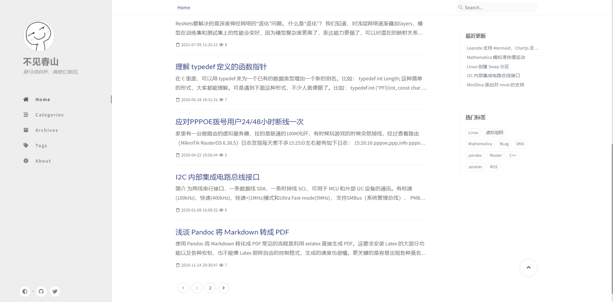

<div align="center">

  # Chirpy Leanote Theme

  这是一款简约而强大、采用响应式设计的 Leanote 主题，适合展示专业写作内容。

  本主题是 [Chirpy Jekyll Theme](https://chirpy.cotes.info) 的移植。通过 [issue #83](https://github.com/leanote/leanote/issues/83) 得知了这款主题，可以说是一见钟情了，马上动手移植，大体框架算是移植完成了。

  [](https://github.com/ctaoist/leanote-theme-chirpy/blob/master/LICENSE)
  [](https://996.icu)

  [**线上体验 →**](https://blog.ctaoist.cn)

  [](https://blog.ctaoist.cn)

</div>

## 功能一览

- 深色模式
- 可选的 Disqus 评论，Valine 评论，GitTalk 评论
- 语法高亮，一键复制
- 数学表达式
- 文章目录、二级目录
- 可选的 Leancloud 文章阅读量统计、Leanote 自带的阅读量统计
- Mermaid、ChartJs 图表
- Google 分析

## 安装

1. 参考 [Leanote Wiki](https://github.com/leanote/leanote/wiki/Leanote-%E4%BA%8C%E8%BF%9B%E5%88%B6%E7%89%88%E8%AF%A6%E7%BB%86%E5%AE%89%E8%A3%85%E6%95%99%E7%A8%8B----Mac-and-Linux) 安装 Leanote 服务端
2. 下载这个仓库的压缩包，在 Leanote 主题配置页面导入即可。

## 使用

根据个人需要去修改 `theme.json` 的内容，都有注释介绍用法，其中评论和文章阅读统计功能默认是关闭的，想打开需要把相应的 `Enable` 选项改成 `true`。

### 使用 Gitalk 评论

1. 首先需要一个已存在或创建一个新的github存储库用来存放 Issues
2. 然后还需要一个 **GitHub Application**，创建一个 [GitHub Application](https://github.com/settings/applications/new)，`Homepage URL` 和 `Authorization callback URL` 填写博客地址，其他可以随意填写。
3. 找到 `Client ID` 和 `Client secrets` 等参数填入 `theme.json` 中：

```json
"Gitalk": {
  "clientID": "", // // GitHub Application Client ID
  "clientSecret": "",
  "repo": "", // 存放评论的仓库
  "owner": "", // 仓库的创建者
  "admin": [""]  // 如果仓库有多个人可以操作，在这里以数组形式写出
},
```

>注：json 配置块不能含有注释信息

更具体可参考 [gitalk install](https://github.com/gitalk/gitalk#install)

Gitalk 需要手动初始化所有文章的评论：用自己的 Github 账号登录 Gitalk 评论后，需要手动点开一遍所有的文章。以后看能否写一个初始化的脚本。

### 使用 Valine 评论

如果想使用 Valine 评论， 需要在 Leacloud 创建应用，获取 `appId` 和 `appId` 填入 `theme.json` 中：

```json
"Valine": {
  "appId": "",
  "appKey": ""
},
```

更具体可参考 [Valine 快速开始](https://valine.js.org/quickstart.html)

### Leancloud 文章阅读量统计

如果不想用 Leanote 自带的文章阅读量统计，可以切换 Leancloud 版本，仍然要在 Leacloud 创建应用。

## Todo

1. [x] Chartjs功能转到主题那边实现并适配夜间模式
1. [x] MathJax 升级到 3.0 [](https://www.osgeo.cn/mathjax/upgrading/v2.html)
1. [x] 支持 [Valine](https://valine.js.org/)，一款基于LeanCloud的快速、简洁且高效的无后端评论系统
1. [x] 支持 [GitTalk](https://github.com/gitalk/gitalk)
1. [] 本地化外观语言
1. [] 自动推荐相关文章
1. [] [Gitalk 初始化脚本](https://draveness.me/git-comments-initialize/)

## Bug 或者不足

1. [x] Emoji container 适配夜间模式
1. [x] MathJax 升级到3.0后，不使用原来的代码，公式中的换行(双斜杠)会被转义成单斜杠，暂代方案是使用(`\\\`)或者 `\newlineh` 或者 [`\displaylines`](https://github.com/mathjax/MathJax/issues/2312)。目前是参考了 [Hexo下mathjax的转义问题](https://segmentfault.com/a/1190000007261752) 和 [使Marked.js与MathJax共存](https://blog.csdn.net/emptyset110/article/details/50123231)， 取消了对 `\\` 和 `\{}` 的转义，公式能够正常换行，但有没有别的 Bug 还有待观察
1. [x] 代码块下部离文字太近
1. [x] post 的阅读次数没有增加：可选使用 Leanote 自带的阅读计数或者用 LeanCloud 的阅读计数
1. [] 由于 Go Template 功能受限，主页的分页并没有列出所有的页码
1. [] Leanote 的分类页面的逻辑和 Jekyll、Hexo 等的不一样，Leanote 不渲染相应的页面，所以分类页面虽然完成了移植，但功能不可用
1. [] 将博客设置里的排序方式改成按照创建时间排序后，影响的只有主页的排序，归档页面仍然是按照 PublicTime 排序的。

## 反馈

使用过程中，如果遇到问题，请给作者提 [Issue](https://github.com/ctaoist/leanote-theme-chirpy/issues) 。

## 赞助

如果您喜欢此款主题或者它对您有帮助，请考虑打赏作者，您的支持将会极大地鼓励作者，并帮助作者更好地维护项目！

[](https://cdn.jsdelivr.net/gh/ctaoist/files@master/images/wechat_pay.jpg)
[](https://cdn.jsdelivr.net/gh/ctaoist/files@master/images/alipay.jpg)

## 许可证书

本项目开源，基于 [MIT](https://github.com/ctaoist/leanote-theme-chirpy/blob/master/LICENSE) 许可。